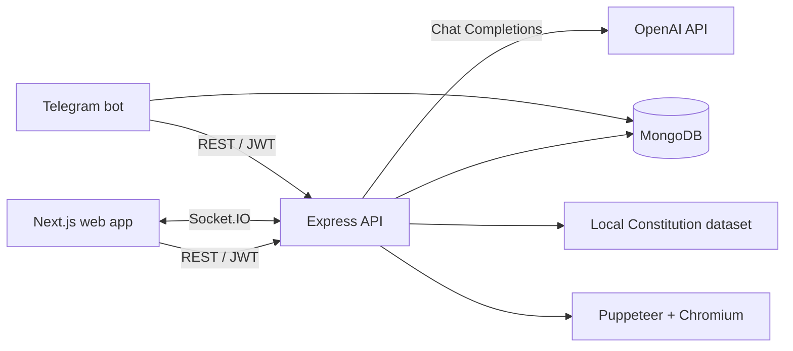

# LawSense — AI Legal Assistant

[](https://www.typescriptlang.org/)
[](https://nextjs.org/)
[](https://nodejs.org/)
[](LICENSE)

LawSense is a full-stack legal information platform focused on the legislation of the Republic of Kazakhstan. It combines an AI legal assistant, document generation, account-based conversation history, real-time communication with lawyers, and a Telegram interface in one TypeScript monorepo.

The project demonstrates end-to-end product development: responsive UI engineering, REST and WebSocket APIs, authentication and authorization, AI/RAG integration, PDF generation, MongoDB data modeling, bot development, and container-based deployment.

> [!IMPORTANT]
> LawSense provides information for educational and reference purposes. It does not replace advice from a qualified legal professional. The bundled legal dataset is curated locally and is not automatically synchronized with changes in Kazakhstan law.

## Contents

- [Features](#features)
- [Engineering Highlights](#engineering-highlights)
- [Architecture](#architecture)
- [Technology Stack](#technology-stack)
- [Repository Structure](#repository-structure)
- [Getting Started](#getting-started)
- [Environment Variables](#environment-variables)
- [Available Commands](#available-commands)
- [API Overview](#api-overview)
- [Deployment](#deployment)
- [Security and Data Notes](#security-and-data-notes)
- [License](#license)

## Features

- **AI legal assistant** — answers questions about Kazakhstan legislation using OpenAI models and relevant excerpts retrieved from a local Constitution dataset.
- **Multilingual conversations** — detects and responds in Kazakh, Russian, or English.
- **Source context** — returns relevant Constitution articles and excerpts alongside AI answers.
- **Anonymous and authenticated chat** — supports short-lived in-memory guest sessions and persistent MongoDB-backed user conversations.
- **Conversation management** — create, view, rename, continue, and delete saved chats.
- **Document generation** — validates form data and generates downloadable PDFs with Puppeteer and Chromium.
- **Three document workflows** — pre-trial claim, explanatory note, and resignation letter.
- **User accounts** — registration, login, profile editing, password changes, password hashing, and JWT-protected endpoints.
- **Lawyer communication** — browse lawyer accounts and exchange real-time messages with typing indicators, read state, and unread counters.
- **Lawyer dashboard** — role-protected access to client conversations.
- **Telegram companion bot** — sign in to an existing account, select or create a chat, and continue the same AI conversation from Telegram.
- **Operational endpoints** — API health and AI availability checks for local development and deployment monitoring.

## Engineering Highlights

This repository showcases practical experience with:

- designing a modular full-stack TypeScript application;
- building responsive interfaces with the Next.js App Router and Tailwind CSS;
- structuring Express controllers, services, middleware, routes, and Mongoose models;
- implementing JWT authentication, bcrypt password hashing, role checks, CORS, and security headers;
- integrating LLM APIs with retrieval-augmented prompts, retry logic, fallback models, and user-friendly error handling;
- building real-time, authenticated messaging with Socket.IO;
- rendering production-ready PDFs from HTML with headless Chromium;
- sharing backend conversations across web and Telegram clients;
- preparing separate services for Vercel, Railway, and Docker-based deployment.

## Architecture



- The **web client** provides public and authenticated chat, document forms, account management, and lawyer messaging.
- The **backend** owns authentication, business rules, AI orchestration, document generation, persistence, and real-time events.
- **MongoDB** stores users, authenticated AI chats, generated documents, lawyer conversations, and Telegram session mappings.
- The **Telegram bot** reuses the backend API rather than duplicating authentication or AI logic, keeping chat history synchronized across clients.

## Technology Stack

| Area | Technologies |
| --- | --- |
| Frontend | Next.js 14, React 18, TypeScript, Tailwind CSS, Zustand, Lucide React |
| API | Node.js, Express, TypeScript, REST, Socket.IO |
| AI and retrieval | OpenAI Node SDK, GPT-4o mini, GPT-3.5 Turbo fallback, local Constitution search |
| Database | MongoDB, Mongoose |
| Authentication and security | JWT, bcryptjs, Helmet, CORS |
| Documents | Puppeteer, headless Chromium, HTML-to-PDF rendering |
| Telegram | Telegraf, Axios, MongoDB-backed bot sessions |
| Tooling and deployment | npm, Docker, Vercel, Railway |

## Repository Structure

```text
AI-Legal-Assistant/
├── frontend/              # Next.js web application
│   ├── app/               # App Router pages and layouts
│   ├── components/        # Shared UI and chat components
│   ├── hooks/             # Socket.IO integration
│   ├── services/          # REST API clients
│   └── store/             # Persisted Zustand state
├── backend/               # Express API and Socket.IO server
│   ├── src/controllers/   # HTTP request handlers
│   ├── src/middlewares/   # Authentication and error handling
│   ├── src/models/        # Mongoose schemas
│   ├── src/routes/        # REST route definitions
│   ├── src/services/      # AI, PDF, and real-time services
│   ├── src/data/          # Kazakhstan Constitution dataset
│   └── scripts/           # Development seed utilities
├── telegram-bot/          # Standalone Telegraf service
├── ai/                    # Prompt and retrieval reference material
├── docs/                  # Project documentation and planning notes
├── DEPLOYMENT.md          # Detailed Vercel and Railway guide
└── package.json           # Railway-compatible root scripts
```

## Getting Started

### Prerequisites

Install the following before starting:

- [Node.js](https://nodejs.org/) 18 or later;
- npm, included with Node.js;
- [MongoDB](https://www.mongodb.com/) running locally or a MongoDB Atlas connection string;
- an [OpenAI API key](https://platform.openai.com/api-keys) to enable AI responses;
- optionally, a Telegram bot token from [@BotFather](https://t.me/BotFather) to run the companion bot.

### 1. Clone the repository

```bash
git clone https://github.com/MZhann/AI-Legal-Assistant.git
cd AI-Legal-Assistant
```

### 2. Configure and start the backend

```bash
cd backend
npm ci
cp env.example .env
npm run dev
```

Edit `backend/.env` and supply at least your MongoDB connection and OpenAI API key:

```dotenv
PORT=3001
NODE_ENV=development
MONGODB_URI=mongodb://localhost:27017/ai-legal-assistant
API_PREFIX=/api/v1
CORS_ORIGIN=http://localhost:3000
OPENAI_API_KEY=your-openai-api-key
JWT_SECRET=replace-with-a-long-random-secret
JWT_EXPIRES_IN=7d
```

The API starts at `http://localhost:3001`, with REST routes under `http://localhost:3001/api/v1`. Check the database-aware health endpoint at `http://localhost:3001/api/v1/health`.

MongoDB is optional only for anonymous AI sessions. Accounts, persistent chat history, saved documents, lawyer messaging, and the Telegram bot require a working database connection.

### 3. Start the frontend

Open a second terminal from the repository root:

```bash
cd frontend
npm ci
cp env.example .env.local
npm run dev
```

The frontend defaults to `http://localhost:3001/api/v1`. If the backend runs elsewhere, set this in `frontend/.env.local`:

```dotenv
NEXT_PUBLIC_API_URL=http://localhost:3001/api/v1
```

Open `http://localhost:3000` in your browser.

### 4. Optionally add a demo lawyer

With MongoDB running and the backend environment configured:

```bash
cd backend
node scripts/seed-saul-goodman.mjs
```

This development utility creates the demo lawyer account printed by the script. Do not use its sample credentials in a production environment.

### 5. Optionally start the Telegram bot

The backend must already be reachable. From a third terminal:

```bash
cd telegram-bot
npm ci
cp .env.example .env
npm run dev
```

Example local configuration:

```dotenv
TELEGRAM_BOT_TOKEN=your-telegram-bot-token
BACKEND_API_URL=http://localhost:3001/api/v1
MONGODB_URI=mongodb://localhost:27017/ai-legal-assistant
NODE_ENV=development
PORT=8080
```

The bot uses long polling and supports `/login`, `/logout`, `/chats`, `/new`, `/whoami`, and regular text messages. See the [Telegram bot documentation](telegram-bot/README.md) for its complete workflow.

> On Windows PowerShell, use `Copy-Item env.example .env` and `Copy-Item env.example .env.local` in place of `cp` if needed. For the bot, use `Copy-Item .env.example .env`.

## Environment Variables

### Backend

| Variable | Required | Default | Purpose |
| --- | --- | --- | --- |
| `PORT` | No | `3001` | HTTP and Socket.IO server port |
| `NODE_ENV` | No | `development` | Runtime environment |
| `MONGODB_URI` | For persistent features | Local MongoDB URL in development | Database connection string |
| `API_PREFIX` | No | `/api/v1` | REST API prefix |
| `CORS_ORIGIN` | Yes in production | `http://localhost:3000` in development | Allowed web origin |
| `OPENAI_API_KEY` | For AI chat | — | OpenAI API credential |
| `JWT_SECRET` | Yes in production | Development-only fallback | Token signing secret; production requires at least 32 characters |
| `JWT_EXPIRES_IN` | No | `7d` | Token lifetime |

### Frontend

| Variable | Required | Default | Purpose |
| --- | --- | --- | --- |
| `NEXT_PUBLIC_API_URL` | Yes in production | `http://localhost:3001/api/v1` | Public backend API base URL |

### Telegram bot

| Variable | Required | Default | Purpose |
| --- | --- | --- | --- |
| `TELEGRAM_BOT_TOKEN` | Yes | — | Token issued by BotFather |
| `BACKEND_API_URL` | Yes | — | Backend URL including `/api/v1` |
| `MONGODB_URI` | Yes | — | Database used for Telegram session mappings |
| `NODE_ENV` | No | `development` | Runtime environment |
| `PORT` | No | `8080` | Lightweight health-server port |

Never commit real secrets or `.env` files. The service-specific `.gitignore` files already exclude local environment files.

## Available Commands

Run each command from the corresponding service directory.

| Service | Command | Description |
| --- | --- | --- |
| Frontend | `npm run dev` | Start the Next.js development server |
| Frontend | `npm run build` | Create a production build |
| Frontend | `npm start` | Serve the production build |
| Frontend | `npm run typecheck` | Run TypeScript without emitting files |
| Backend | `npm run dev` | Start the API with watch mode |
| Backend | `npm run build` | Compile TypeScript into `dist/` |
| Backend | `npm start` | Run the compiled API |
| Backend | `npm run typecheck` | Run strict TypeScript checks |
| Telegram bot | `npm run dev` | Start the bot with watch mode |
| Telegram bot | `npm run build` | Compile TypeScript into `dist/` |
| Telegram bot | `npm start` | Run the compiled bot |
| Telegram bot | `npm run typecheck` | Run strict TypeScript checks |

There is currently no automated test suite. Before submitting changes, run the type checks and production builds for every service you modified.

## API Overview

All application endpoints use the `/api/v1` prefix unless noted otherwise.

| Route group | Purpose | Access |
| --- | --- | --- |
| `/auth` | Registration, login, profile, and password management | Public and JWT-protected |
| `/chat` | Anonymous AI sessions, service status, and Constitution search | Public |
| `/user/chats` | Persistent AI conversation management | JWT-protected |
| `/documents` | Document types, PDF generation, downloads, and saved documents | Public and JWT-protected |
| `/lawyers` | Lawyer discovery, conversations, and lawyer dashboard | Public, JWT-protected, and role-protected |
| `/health` | API and database health, plus ping | Public |

Protected REST requests expect the token in the standard header:

```http
Authorization: Bearer <token>
```

The Socket.IO server uses the same JWT during connection setup and exposes events for joining chats, sending messages, typing state, and read receipts.

## Deployment

The repository is structured for independent service deployment:

- **Frontend:** Vercel, with `frontend` as the root directory.
- **Backend:** Railway, with `backend` as the root directory. Its Dockerfile installs Chromium for PDF generation.
- **Telegram bot:** a separate Railway service, with `telegram-bot` as the root directory.
- **Database:** MongoDB Atlas or another reachable MongoDB deployment.

Production requires explicit URLs and secrets. In particular, set the backend `CORS_ORIGIN` to the exact frontend origin and set `NEXT_PUBLIC_API_URL` to the public backend URL including `/api/v1`.

See [DEPLOYMENT.md](DEPLOYMENT.md) for the complete deployment checklist. Note that the current AI implementation uses `OPENAI_API_KEY`; any older `GOOGLE_AI_API_KEY` reference in deployment notes is legacy configuration.

## Security and Data Notes

- Passwords are hashed with bcrypt before storage.
- Protected REST endpoints and real-time connections validate JWTs.
- The Express API applies Helmet security headers and an explicit CORS policy.
- Authenticated chat history and PDFs saved by signed-in users are stored in MongoDB.
- Anonymous chat sessions are held in server memory and are removed after inactivity; they do not survive a process restart.
- Telegram stores the user's backend JWT and active chat mapping in a dedicated MongoDB collection.
- Generated legal documents and AI responses should be reviewed before real-world use.

## License

Distributed under the [MIT License](LICENSE).

## Author

Created and maintained by [Zhanbolat / MZhann](https://github.com/MZhann).

If this project is useful to you, consider starring the repository or opening an issue with feedback.
